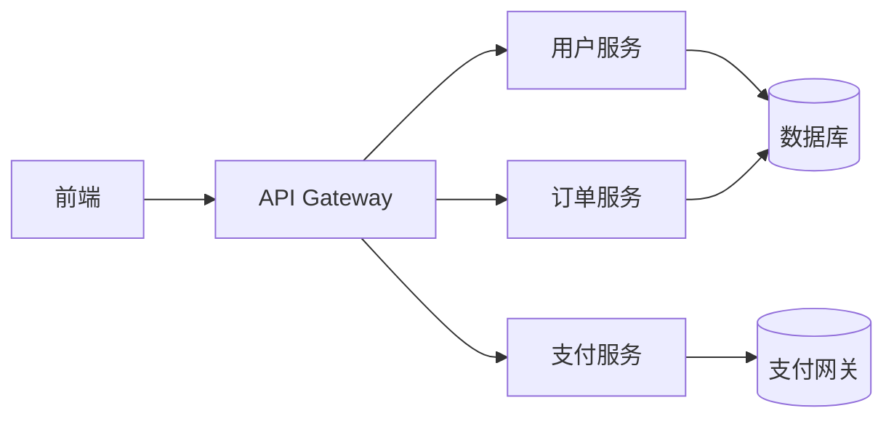

# Integration Map — 集成关系图

本文档定义系统间的集成关系和依赖。

---

## 系统集成图

---

## 服务依赖矩阵

| 服务 | 依赖服务 | 依赖类型 |
|------|---------|----------|
| 前端 | API Gateway | HTTP |
| API Gateway | 用户服务 | HTTP/gRPC |
| API Gateway | 订单服务 | HTTP/gRPC |
| API Gateway | 支付服务 | HTTP/gRPC |
| 用户服务 | 数据库 | SQL |
| 订单服务 | 数据库 | SQL |
| 支付服务 | 支付网关 | API |