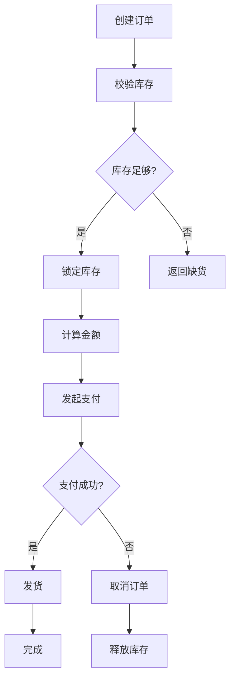

# Core Flows — 核心业务流程

本文档定义系统中核心业务流程。

---

## 订单流程

```mermaid
flowchart TD
    A[创建订单] --> B[校验库存]
    B --> C{库存足够?}
    C -->|是| D[锁定库存]
    C -->|否| E[返回缺货]
    D --> F[计算金额]
    F --> G[发起支付]
    G --> H{支付成功?}
    H -->|是| I[发货]
    H -->|否| J[取消订单]
    I --> K[完成]
    J --> L[释放库存]
```

---

## 用户注册流程

1. 填写注册信息
2. 验证手机号/邮箱
3. 设置密码
4. 提交注册
5. 发送欢迎邮件

---

## 支付流程

1. 选择支付方式
2. 跳转支付网关
3. 完成支付
4. 回调通知
5. 更新订单状态