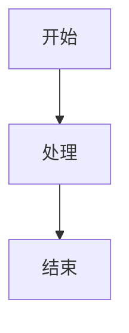
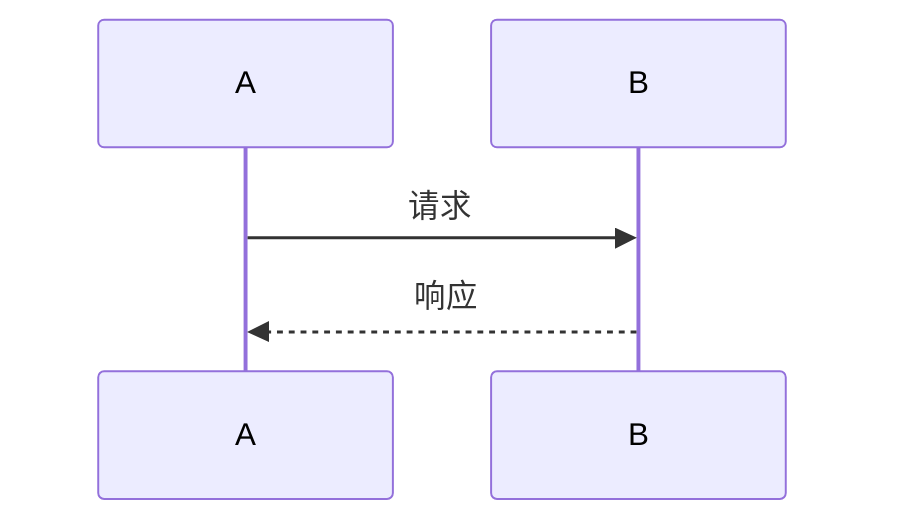

# Global Diagram Standard — 图表规范

本文档定义文档中图表的使用规范。

---

## 图表工具选择

| 工具 | 适用场景 | 输出格式 |
|------|---------|----------|
| Mermaid | 流程图、架构图、时序图 | .mmd → PNG |
| PlantUML | 复杂 UML 图 | .puml → PNG |
| 手绘风格 | 快速草图 | PNG |

---

## Mermaid 图表类型

### 流程图

### 时序图

### 架构图

---

## 图表渲染要求

1. 使用标准脚本渲染：`scripts/mermaid-render.sh`
2. 图表尺寸：宽度 ≥ 1200px
3. 输出格式：PNG
4. 嵌入方式：Markdown 图片或代码块

---

## 图表命名规范

| 类型 | 命名格式 | 示例 |
|------|---------|------|
| 流程图 | `{模块}-{流程名}-flowchart.png` | `order-create-flowchart.png` |
| 时序图 | `{模块}-{场景}-sequence.png` | `payment-charge-sequence.png` |
| 架构图 | `{系统}-architecture.png` | `user-system-architecture.png` |